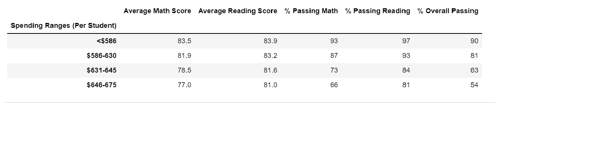
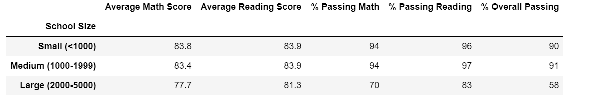
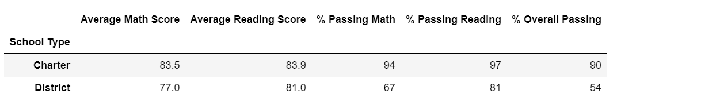

# School_District_Analysis

## Project Overview
   There are evidences of having incorrect/altered grades for 9th graders in Thomas High School. So the school board needs to uphold the state-testing standards. We need to replace the math & reading scores for this high school with NaNs, and leave the rest of the data as it is.

## Results

How is the district summary affected?

  we can see from both the screenshots that after removing the Thomas High School scores, passing math, reading and overall percentages have changed.

 
 
	
How is the school summary affected?

How does replacing the ninth graders’ math and reading scores affect Thomas High School’s performance relative to the other schools?
  AS we can see from the above screenshots, replacing the ninth graders' scores with NaNs increased the percentages overall.

How does replacing the ninth-grade scores affect the following:
### Math and reading scores by grade
    Since these were found altered, we have replaced this scores for 9th grade with NaNs.

### Scores by school spending
    If we look at spending ranges(per student), the scores are unaffected by the change in the 9th grade scores.
     
    
### Scores by school size
   If we go by the school size, the scores are unaffected by the change in the 9th grade scores.
    

### Scores by school type
   By looking at the types of the school - Distict / Charter - the scores remained unchanged.
    

## Summary
  By reviewing and analyzing the results, it can be concluded that by replacing the 9th grade math and reading scores, for Thomas High School, with NaNs, the overall  school performance has been improved. But when looking at the more bigger picture like - by school type, or school size, it didn't make any difference at that level
